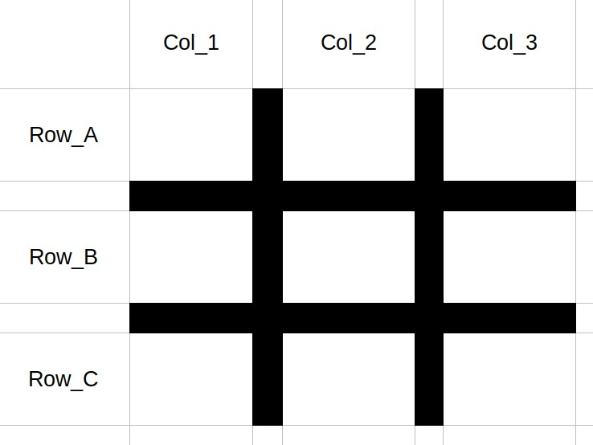
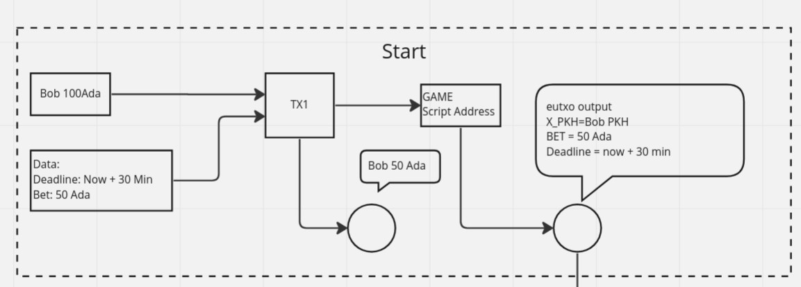
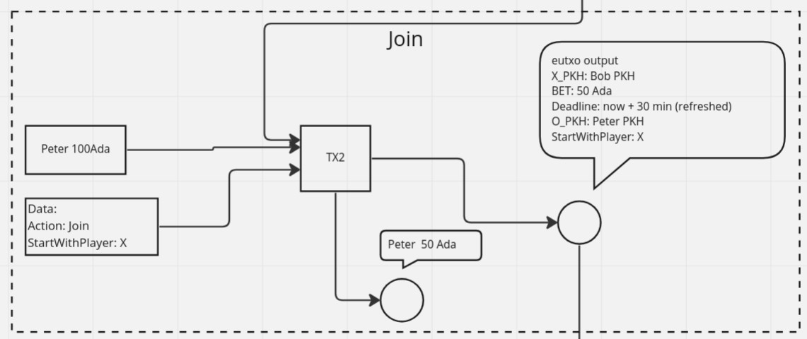
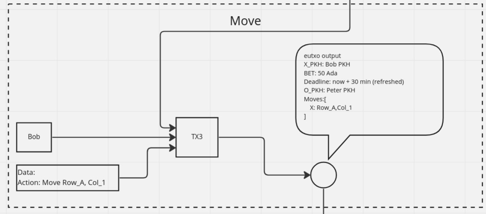
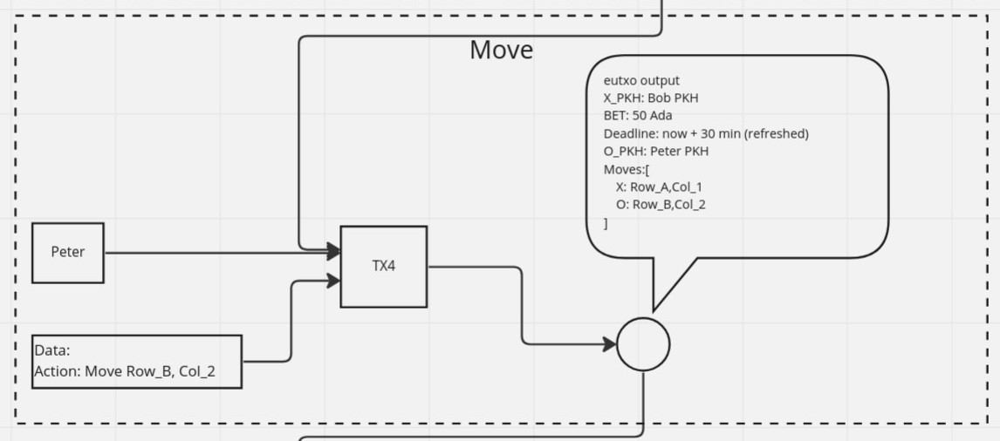
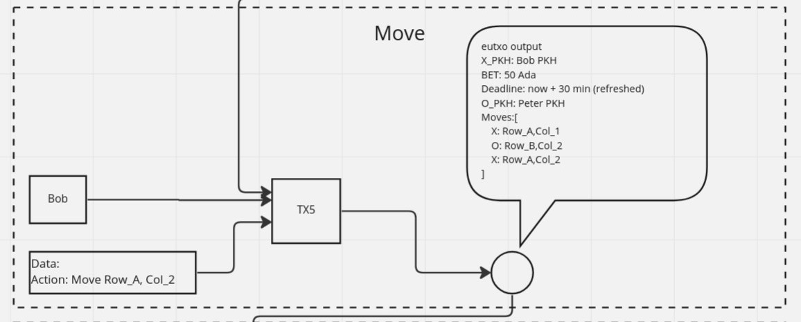
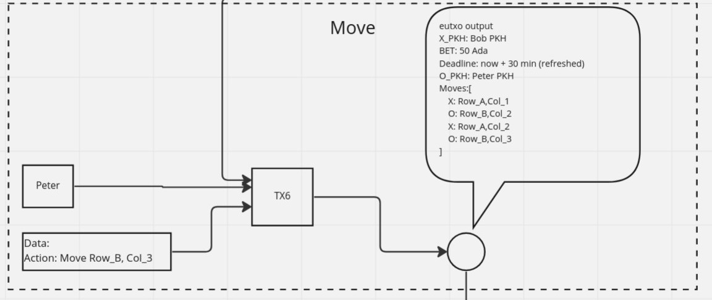
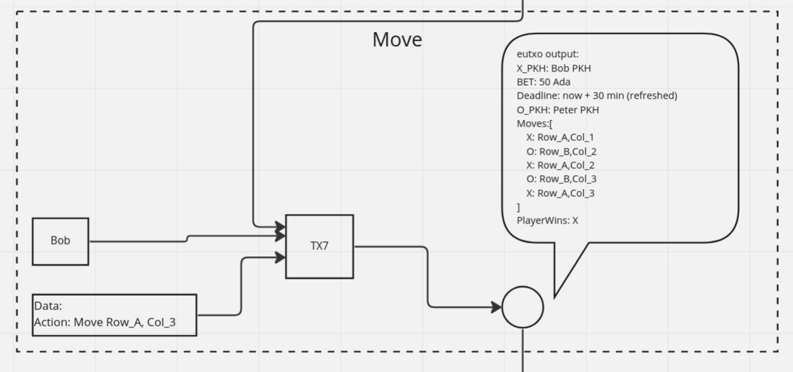
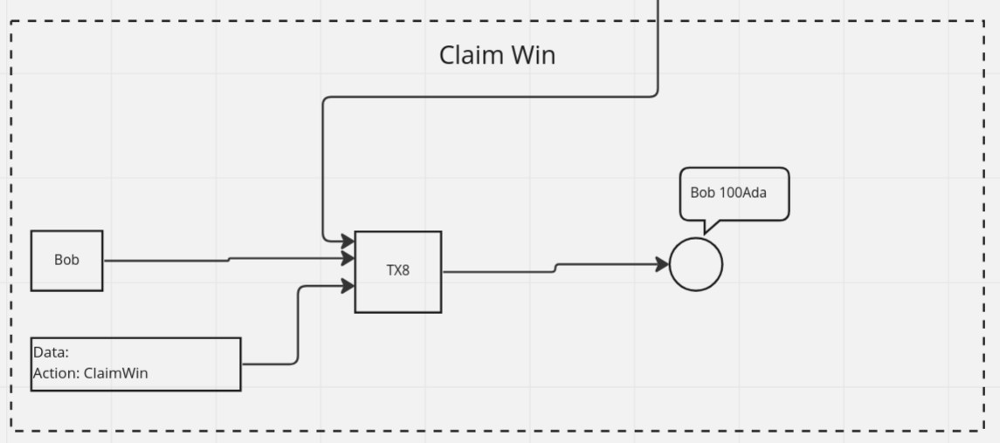

# TicTacToeWithBettingOnChain with a twist

TicTacToe with betting on Cardano blockchain.
With a Twist. The secret souce is to get the top row A1,A2,A3 to win.
No other patterns will win.

## Grid

## Example Flow of a game.

(The images below are for illustrative purposes only and may differ from the actual implementation.)

Below are 8 transactions to complete a game.  
Two PLayers, Bob and Peter, wants to play a game of Tic Tac Toe with betting.  
Only Bob knows the secret of the game.  
Bob starts the game by betting 50Ada and setting the timeout of the game to 30min per round.  

Peter has 30 mins to join the game and match Bob's 50 Adas, else the game will be cancelled and Bob can reclaim his bet.
The App will randomly selects a player to start. e.g X

Bob has 30mins to make a move or the game will end in a tie.  
Bob moves to Row_A, Col_1

Peter has 30mins to make a move or Bob will win.  
Peter moves to Row_B, Col_2

Bob has 30mins to make a move or Peter will win.  
Bob moves to Row_A, Col_2

Peter has 30mins to make a move or Bob will win.  
Peter moves to Row_B, Col_3

Bob has 30mins to make a move or Peter will win.  
Bob moves to winning move of Row_A, Col_3

Bob can now claim the winnings.

# Instruction

The transaction construction will happen with cardanocli-js as individual steps to create the transactions to play the game and simulate async interactions.

### How to builde the plutus script.

- putus-apps tag for nix shell: v1.0.0
- inside the plutus apps nix-shell, navigate back to root of this project.
- run `cabal repl`
- run `:l Deploy`
- run `writeTicTacToeValidator` , this will write to testnet/ticTacToe.plutus

## Validator requirement implementation onchain

- [ ] can join initiated game
  - [x] game initiated with valid parameters (enforced by types)
  - [x] initiated game value must match the bet value
  - [ ] joining value must match the bet value
  - [ ] output value goes to script
  - [ ] output gamestate is valid
    - playerTwoPubKeyHash value is added from command

- [ ] can make move
  - [x] current gamestate with valid params (enforced by types)
  - [ ] the move in the command matches the next player to make move.
  - [x] ensure game is playable [ not won or tied , ensured by types]
  - [ ] check output game state valid after making move
    - [ ] isGameWon
    - [ ] isGameTied
  - [ ] can claim win
    - [x] is game in winning state (enforced by types)
    - [ ] ensure output value goes to winner address
  - [ ] can claim tie
    - [x] is game in tied state (enforced by types)
    - [ ] ensure output values are split between players

  - [ ] can cancel initiated game
    - [x] game state must be in initiated state ( ensure by types)
    - [ ] has enough time passed as specified.[stuck here with tx intervals]
    - [ ] output value return to playerOne
  - [ ] can cancel in progress game
    - [x] game state must be in in-progrogress state ( ensure by types)
    - [ ] has enough time passed as specified.[stuck here with tx intervals]
    - [ ] determine winner
    - [ ] output value goes to winner