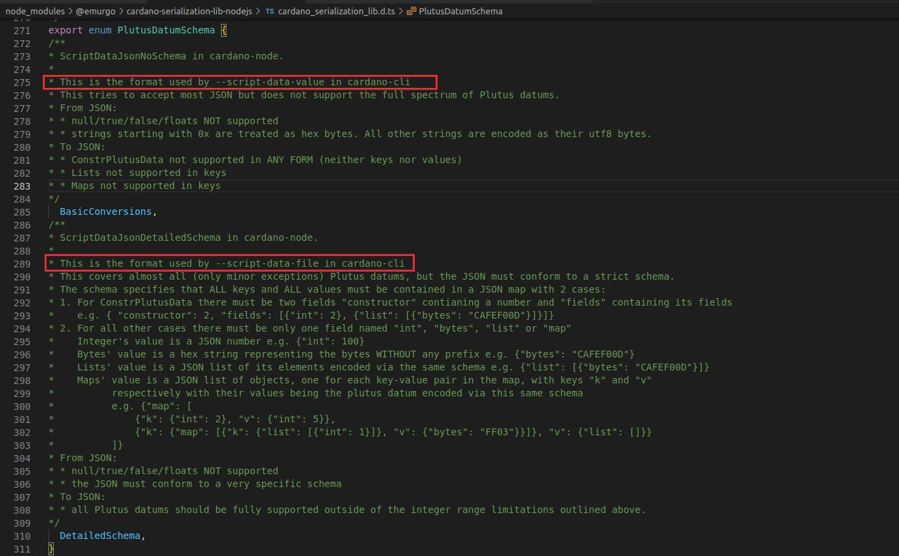

# unclear inline datum requirement/limitations

```text
  --tx-out-inline-datum-file JSON FILE
                           The script datum to embed in the tx output as an
                           inline datum, in the given JSON file. The file must
                           follow the special JSON schema for script data.
  --tx-out-inline-datum-value JSON VALUE
                           The script datum to embed in the tx output as an
                           inline datum, given here in JSON syntax. There is no
                           schema: (almost) any JSON value is supported,
                           including top-level strings and numbers.
```


